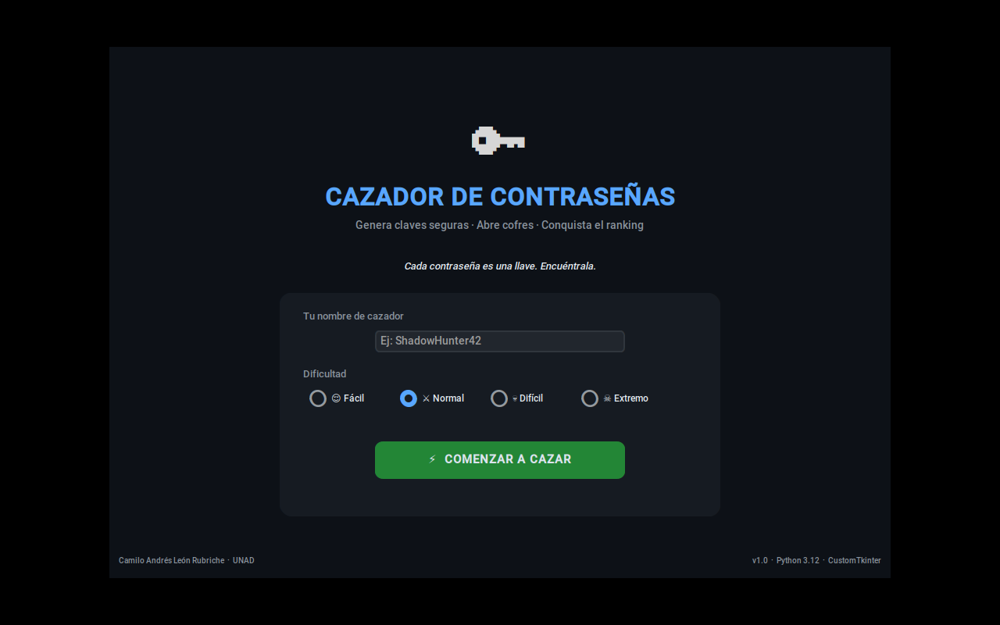
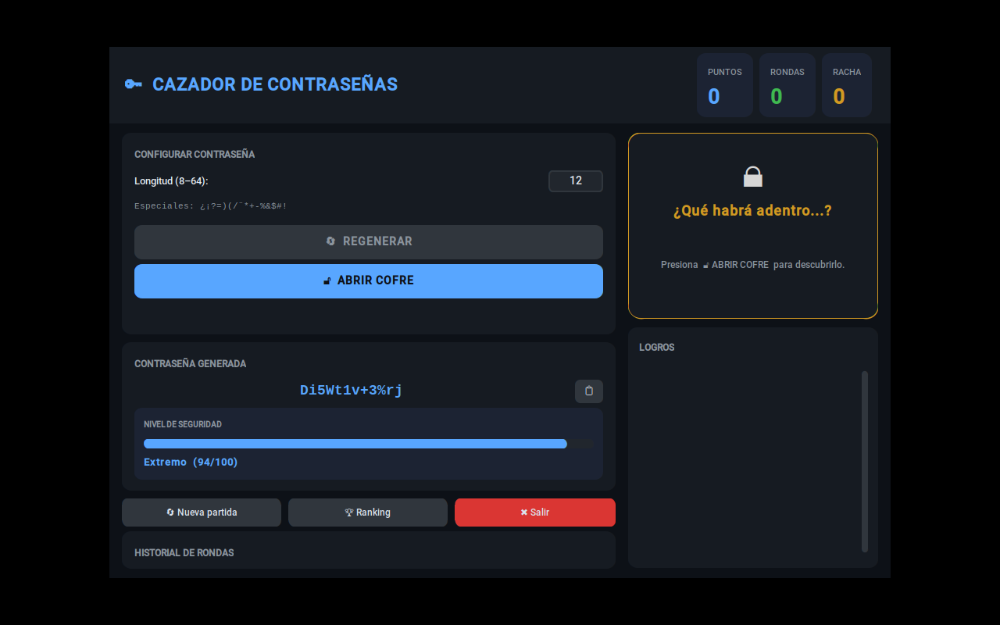
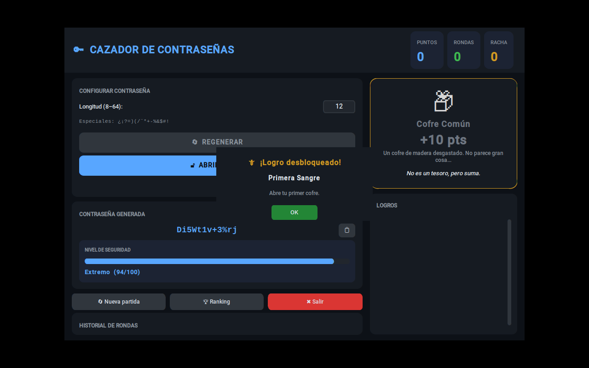
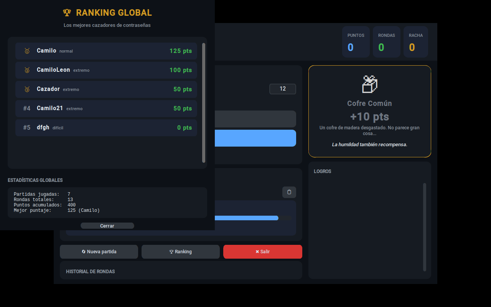

🌐 [English version](README.md) | Español

# 🔑 Cazador de Contraseñas


**Autor:** Camilo Andrés León Rubriche  
**Institución:** Universidad Nacional Abierta y a Distancia — UNAD  
**Curso:** Programación — Cuarto semestre  
**Versión:** 1.0.0

---

> **Juego educativo de Python** que combina generación de contraseñas seguras, mecánicas de cofres aleatorios y un sistema de puntuación persistente, construido con arquitectura limpia y Programación Orientada a Objetos.

---

## Descripción

Cazador de Contraseñas es un videojuego casual de escritorio donde el jugador genera contraseñas criptográficamente fuertes para desbloquear cofres virtuales. Cada contraseña válida abre un cofre aleatorio —común, raro, legendario o maldito— que otorga o resta puntos. La dificultad ajusta las probabilidades de los cofres y el multiplicador de puntos.

El objetivo académico es demostrar en un proyecto integrador: **POO**, **herencia**, **polimorfismo**, **manejo avanzado de excepciones** y **buenas prácticas** de desarrollo en Python.

## Capturas de pantalla

| Pantalla de inicio | Contraseña generada |
|---|---|
|  |  |

| Cofre abierto + logro desbloqueado | Ranking global y estadísticas |
|---|---|
|  |  |

---

## Características

| Categoría | Detalle |
|---|---|
| **Contraseñas** | Generación aleatoria sin caracteres repetidos, validación de 6 reglas, análisis de fortaleza 0-100 |
| **Cofres** | 4 tipos con herencia y polimorfismo, probabilidades ajustables por dificultad |
| **UI** | CustomTkinter tema oscuro, animaciones, barra de progreso, panel de historial |
| **Persistencia** | Ranking local JSON, historial de sesiones, estadísticas globales |
| **Logros** | 5 logros desbloqueables con popup de notificación |
| **Dificultades** | Fácil / Normal / Difícil / Extremo (cambia probabilidades y multiplicadores) |
| **Sonido** | Efectos con winsound (Windows, opcional) |

---

## Arquitectura

```
CazadorDeContrasenas/
│
├── main.py                   # Punto de entrada
├── config.py                 # Constantes de aplicación
├── requirements.txt
├── LICENSE
├── conftest.py                # Agrega la raíz del proyecto al sys.path para las pruebas
├── tests/                      # Pruebas unitarias (pytest)
│   ├── test_contrasena.py
│   ├── test_cofres.py
│   └── test_jugador.py
├── .github/workflows/
│   └── tests.yml                # CI: corre las pruebas en cada push
│
├── modelos/                  # Capa de dominio (POO pura)
│   ├── contrasena.py         # Generación + validación
│   ├── cofres.py             # Jerarquía de cofres (herencia + polimorfismo)
│   ├── jugador.py            # Estado de sesión
│   └── estadisticas.py      # Estadísticas globales
│
├── vistas/                   # Capa de presentación (CustomTkinter)
│   ├── ventana_principal.py  # Ventana raíz y pantalla de inicio
│   ├── panel_juego.py        # UI del juego activo
│   ├── panel_ranking.py      # Ventana modal de ranking
│   └── componentes.py        # Widgets reutilizables
│
├── controladores/            # Capa de coordinación (MVC)
│   ├── juego_controlador.py  # Orquestador principal
│   └── validaciones_controlador.py
│
├── servicios/                # Capa de infraestructura
│   ├── generador_service.py
│   ├── ranking_service.py
│   ├── estadisticas_service.py
│   └── sonido_service.py
│
├── excepciones/              # Jerarquía de excepciones del dominio
│   └── excepciones.py
│
├── utils/                    # Herramientas transversales
│   ├── constantes.py
│   ├── colores.py
│   ├── helpers.py
│   └── animaciones.py
│
└── data/                     # Persistencia JSON
    ├── ranking.json
    └── historial.json
```

---

## Instalación

```bash
# 1. Clonar o descomprimir el proyecto
cd CazadorDeContrasenas

# 2. Crear entorno virtual (recomendado)
python -m venv venv
venv\Scripts\activate          # Windows
# source venv/bin/activate     # macOS / Linux

# 3. Instalar dependencias
pip install -r requirements.txt

# 4. Ejecutar
python main.py
```

**Requisitos:**
- Python 3.10 o superior (probado en 3.12)
- customtkinter >= 5.2.2

---

## Pruebas

```bash
pip install -r requirements.txt
pytest tests/ -v
```

44 pruebas unitarias cubren la generación/validación de contraseñas (`Contrasena`), la jerarquía y fábrica de cofres (`cofres.py`), y el estado del jugador — puntaje, rachas, logros (`Jugador`). Se ejecutan automáticamente en cada push vía GitHub Actions (ver badge arriba).

---

## Flujo del juego

```
[Pantalla de inicio]
    │  Ingresa nombre y dificultad
    ▼
[Panel de juego]
    │  Define longitud (8–64)
    │  Clic en "Generar y abrir cofre"
    ▼
[Generación]  ──→  Contrasena.generar()
    │
    ▼
[Validación]  ──→  6 reglas + análisis de fortaleza
    │
    ├── Válida ──→  FabricaCofre.crear()  ──→  cofre.abrir()
    │                                            ├── CofreComún    (+10)
    │                                            ├── CofreRaro     (+25)
    │                                            ├── CofreLegendario (+50, ×2 si hay suerte)
    │                                            └── CofreMaldito  (-20)
    │
    └── Inválida ─→  CofreMaldito automático (penalización)
    
    ▼
[Registro]  ──→  Jugador.registrar_ronda()
    │             └── Verificar logros
    ▼
[UI]  ──→  Actualizar puntos, historial, cofre visual
    │
    ▼
[¿Continuar?]  ──→  Sí: nueva ronda
                 └── No: terminar_partida() → guardar ranking
```

---

## Principios de POO implementados

### Encapsulamiento
`Contrasena._valor` es privado; sólo se accede mediante la propiedad `.valor`. `Jugador._puntaje` sólo se modifica a través de `registrar_ronda()`, garantizando consistencia del estado.

### Herencia
`CofreBase` → `CofreComun`, `CofreRaro`, `CofreLegendario`, `CofreMaldito`. Cada subclase hereda la interfaz y redefine únicamente lo que la diferencia.

### Polimorfismo
El método `cofre.abrir()` tiene la misma firma en los cuatro tipos de cofre. `JuegoControlador` llama `cofre.abrir()` sin importar de qué tipo sea; el resultado varía según la subclase.

### Abstracción
`CofreBase` es abstracta (ABC): no puede instanciarse. Define el contrato (métodos abstractos) que las subclases están obligadas a implementar.

### Composición
`JuegoControlador` *tiene* instancias de `GeneradorService`, `RankingService`, `EstadisticasService` y `SonidoService` en lugar de heredar de ellos.

---

## Manejo de excepciones

| Excepción | Cuándo se lanza |
|---|---|
| `LongitudInvalidaError` | Longitud < 8 o > 64 |
| `EntradaNoNumericaError` | El campo de longitud contiene texto no numérico |
| `ContrasenaInvalidaError` | Fallan reglas de seguridad (mayúscula, número, especial...) |
| `CaracterRepetidoError` | La contraseña tiene caracteres duplicados |
| `ErrorPersistencia` | Problemas al leer/escribir archivos JSON |

Todas heredan de `ErrorJuego` → `Exception`, lo que permite capturarlas con granularidad o de forma genérica según el contexto.

---

## Tecnologías

- **Python 3.12**
- **CustomTkinter 5.x** — UI moderna con tema oscuro
- **tkinter** — Base del sistema de ventanas
- **random** — `choice`, `choices`, `sample`, `shuffle`
- **json + pathlib** — Persistencia de datos
- **abc** — Clases abstractas
- **dataclasses** — Tipos valor inmutables
- **threading** — Sonido en hilo separado
- **winsound** — Efectos de sonido (Windows)

---

## Posibles mejoras futuras

- Sistema de logros con persistencia entre sesiones
- Modo multijugador por turnos
- Exportar estadísticas a CSV
- Tema claro / alto contraste
- Internacionalización (i18n)
- Tests unitarios con pytest
- Versión web con Flask + WebSockets
